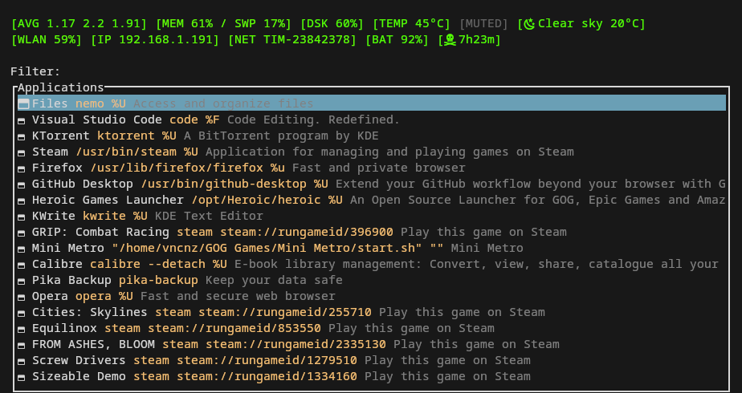
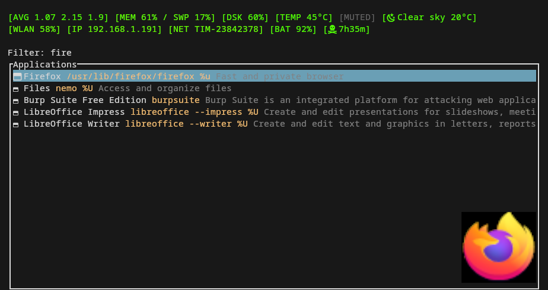
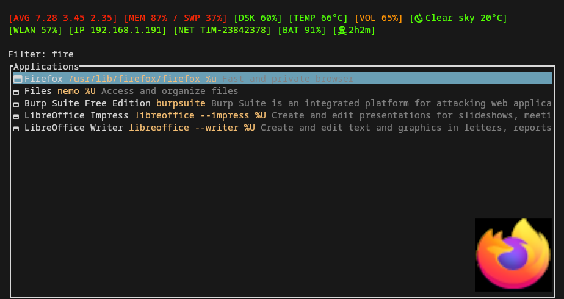
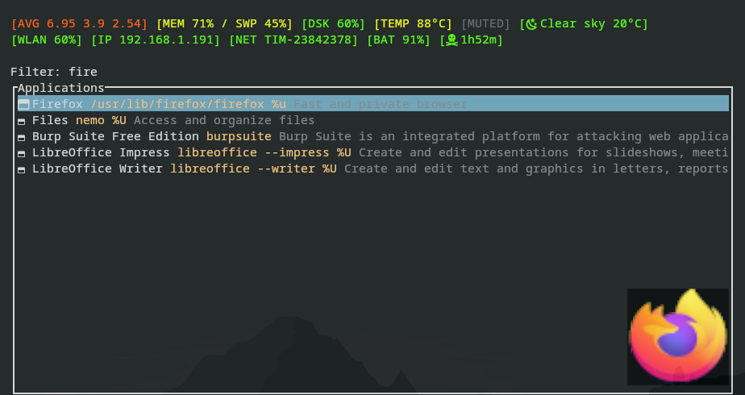

# Fenrir - ᚠᛖᚾᚱᛁᚱ

## About the name

Skoll is, in norse mythology, a wolf who chases the sun, causing eclipses. And it is my gui launcher. So this is Fenrir, Skoll's brother, and it is my TUI launcher.

## UI preview

In the upper area, you can see information about your system health.

In the lower area, you find the launcher part: a filter and a box containing search results. For each result, you get name, command, description. If the app has an icon, it is painter in the lower-right corner.

## About this project

Applications filter is resistent to typos and and missing keystrokes, and results sorting is based on launch history.

After some fine-tuning, on my laptop the TUI appears in ~500µs and app list is ready in ~100ms. You can start typing immediately: your keystrokes won't get lost while the list loads.
if you are not running Fenrir in an already open terminal, remember to account for the terminal's startup time. In that case, I suggest you to use kitty with --single-instance mode for a blazing fast experience.

Information about system resources is collected from another process: Ratatoskr. This is a public project that you can find on my GitHub account, its goal is to gather all system resources information and write it to a single json in /tmp folder. If Ratatoskr isn't up and running, you'll see a warning/hint in the system resources area, but the launcher stays fully usable.

## Screenshots

No warnings, no filter

No warnings, filter with "fire"

High memory usage, high avgload, medium-high volume:

Medium-high memory, medium avgload, muted:

Medium-high avgload, medium memory, medium temp:

With bluetooth headphones connected (headphone battery 100%):

## Note

Please note that this is a personal project, for personal use, developed in my (not so much) free time. You'll not find clean code or a flexible, modular system here. You'll find lots of experiments, abandoned ideas, dead code, temporary hacks and workarounds. Oh, and last but not least, I'm just learning both Rust and GTK. You've been warned.

## TODO

- ~~Insert weather information~~
- ~~Full network information, like IP and networkname, on a dedicated row~~ Done!
- ~~Fix resources information order~~ Done!
- ~~Add battery ETA if available~~ Done!
- Create a dedicated area for selected executable properties and icon?
- ~~Fuzzy search~~ Done!
- ~~History~~ Done!
